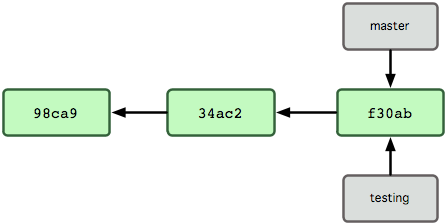
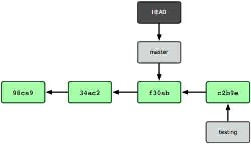
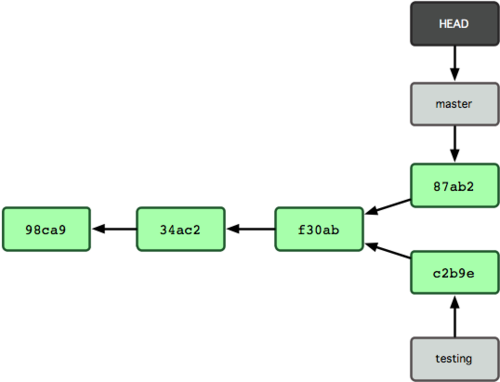

## intro to git

<abbr>fedeoo</abbr>

---

### overview
- why git
- git 基础
- git 工作流
- gitlab
- git 工具

---

### why git

- 快
- 本地执行
- 分支合并简单
- 时刻保持数据完整性(sha-1)

----

### 文件内容-SVN


SVN差异比较

----

### 文件内容-GIT


GIT文件快照 **快**

----

### 分布式


---

### git 安装与配置

windows: [msysgit](http://msysgit.github.io/)

mac: ```brew install git```

```sh
git config --global user.name 'fedeoo'
git config --global user.email 'zhangfei1@staff.sina.com.cn'
git config --global merge.tool vimdiff
git config --list

```
```sh
// 在根目录下的.gitconfig中添加(追加)下面这些
    [alias]
            st = status
            ci = commit
            br = branch
            co = checkout
            last = log -1 HEAD
            unstag = reset HEAD
```


---

### git 基础

- 创建仓库
- 文件状态
- 查看历史
- 撤销操作
- 远程仓库
- 标签

----

### git仓库

- `git://`
- `http(s)://`
- `ssh` <small>user@server:/path.git</small>

```
git init
// or
git clone url
```

----
### 文件状态

```
git status
git add README.md
git diff // git diff --staged
git commit
git rm // git rm --cached
git mv
```

----

### 提交历史

```
git log
选项 说明
    -p 按补丁格式显示每个更新之间的差异。
    --stat 显示每次更新的文件修改统计信息。
    --graph 显示 ASCII 图形表示的分支合并历史。
    --pretty 使用其他格式显示历史提交信息。可用的选项包括 oneline，short，full，fuller 和 format（后跟指定格式）。
    -(n) 仅显示最近的 n 条提交
    --since, --after 仅显示指定时间之后的提交。
    --until, --before 仅显示指定时间之前的提交。
```

----

### 撤销操作

- <!-- .element: class="fragment" data-fragment-index="1" --> 
    #### 修改最后一次提交
    ```git commit --amend```
    遗漏提交
- <!-- .element: class="fragment" data-fragment-index="2" --> 
    #### 取消暂存
    ```git reset HEAD file```
    撤销```git add .```
- <!-- .element: class="fragment" data-fragment-index="3" --> 
    #### 取消对文件修改
    ```git checkout -- file```
    撤销修改

----

### 远程仓库
```
git remote add origin [url]
git fetch origin || git pull origin
git push origin master
git remote rename / git remote rm
```
切换仓库？

----

### 标签
```
git tag
git tag -a v0.0.0 -m '基础版本
git tag -a v0.1.0 a6b3a23 // 追加
git push origin --tags
```

---

## git分支

----

### 何谓分支


单个提交对象在仓库中的数据结构

```
git cat-file -p sha-1 // 查看命令
git verify-pack -v pack.idx
```

----
### 何谓分支


多个提交对象之间的链接关系

----
### 何谓分支


分支其实就是从某个提交对象往回看的历史

----
### 何谓分支


HEAD 指向当前所在的分支

----
### 创建分支 



```git br testing```

----
### 切换分支


改变HEAD指向

```git co testing```

----
### 提交变动


提交后 HEAD 随着分支一起向前移动

``` git commit -am '修改....'```

----
### 切换分支



``` git co master ```

----
### 不同流向的分支历史


```git commit -am '修改之后再次提交'```

----

### 分支合并


当前分支

----
### Fast forward


```
git co master
git merge hotfix
// after merge delete branch
git br -d hotfix
```

----
### 合并分支

```
git co master
git merge iss53
```
```git mergetool``` 处理冲突

----
### rebase
</br>


```
git co master
git rebase experiment
```

----
### 远程分支


```
git push origin master
git fetch origin 
git push origin :dev // 删除分支
```

---

## git工作流

----
### 公共分支


**master**-稳定分支 每次提交都有版本号

----
### 特性分支


特性分支从`develop`分支拉出，合并回`develop`分支

----
### 发布分支


发布分支只做bug修复以及面向发布任务，不加功能

约定名称 `release-*`

----
### 维护分支


---

## Advance

----

- **stash**  储藏变更，但不提交
- **重写历史** 
``` 
git commit --amend
git rebase -i HEAD~3
```
- **squash**
- **数据恢复**  
    ``` 
    git reflog 
    git log -g
    ```
- **调试**
    ```
git blame -L line file
git bisect
    ```


---

## gitlab

[内网gitlab](http://git.intra.weibo.com): git.intra.weibo.com
 <small>邮箱前缀 邮箱密码</small>

Issue

wiki

---

### reference

- [Pro git](http://git.oschina.net/progit/)
- [git flow](http://blog.jobbole.com/76843/)

---

## Q&A

